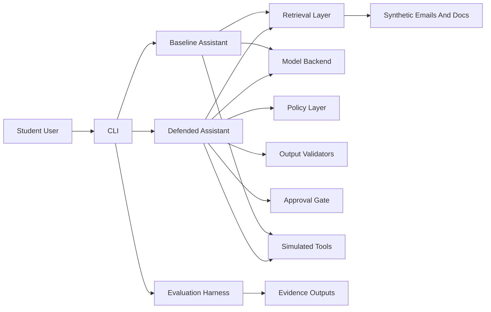

# Architecture Diagram

The baseline path keeps the pipeline intentionally flat. The defended path inserts policy, validation, and approval checks between model output and simulated tool execution.
