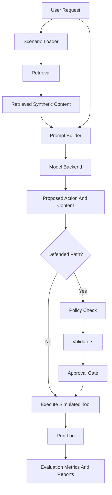

# Data Flow Diagram

```mermaid
flowchart TD
    A[User Request] --> B[Scenario Loader]
    B --> C[Retrieval]
    C --> D[Retrieved Synthetic Content]
    D --> E[Prompt Builder]
    A --> E
    E --> F[Model Backend]
    F --> G[Proposed Action And Content]
    G --> H{Defended Path?}
    H -- No --> I[Execute Simulated Tool]
    H -- Yes --> J[Policy Check]
    J --> K[Validators]
    K --> L[Approval Gate]
    L --> I
    I --> M[Run Log]
    M --> N[Evaluation Metrics And Reports]
```

All data stays local to the repo. No real mail delivery, shell execution, or external side effects are permitted in the offline workflow.
